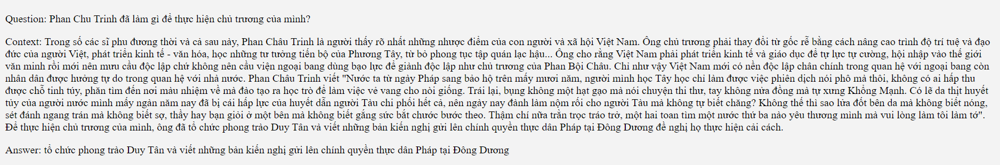

# Question Answering - BARTpho


## About The Project


### Introduction

My project is called **Question Answering**. This is a project carried out by me when I was studying at VietAI Advanced NLP Class 02. In a nutshell, the system in this project helps us *answer* a **Question** of a given **Context**.

## Getting Started

To get started, you should have prior knowledge on **Python** and **Pytorch** at first. A few resources to get you started if this is your first Python or Tensorflow project:

- [Pytorch Tutorials](https://pytorch.org/tutorials/)
- [Python for Beginners](https://www.python.org/about/gettingstarted/)


## Outline

- Data: [UIT-ViQuAD2.0](https://aihub.vn/competitions/35) dataset from VLSP2021.

- Model: `question_answering_bartpho` is based on [BARTpho](https://github.com/VinAIResearch/BARTpho) model.

According to the orginal [paper](https://arxiv.org/abs/2109.09701), it is stated that *BARTpho-syllable and BARTpho-word are the first public large-scale monolingual sequence-to-sequence models pre-trained for Vietnamese. BARTpho uses the "large" architecture and the pre-training scheme of the sequence-to-sequence denoising autoencoder BART, thus it is especially suitable for generative NLP tasks*. Especially in this downstream task, based on our experiments, we choose **BARTpho-syllable** in preference to BARTpho-word.


## Installation and Run

1. Clone the repo

   ```sh
   git clone https://github.com/phkhanhtrinh23/question_answering_bartpho.git
   ```
  
2. Use any code editor to open the folder **question_answering_bartpho**.

3. Run `pip install -r requirements.txt` to install the required packages. 

**Note**: You can install transformer as follows:
```
git clone --single-branch --branch fast_tokenizers_BARTpho_PhoBERT_BERTweet https://github.com/datquocnguyen/transformers.git

cd transformers

pip3 install -e .
```

3. After you have received the permission to download and use UIT-ViQuAD2.0, the structure of the dataset should be as follows:
```text
├── data
|  └── demo.json (not from UIT-ViQuAD2.0)
|  └── test.json
|  └── train.json
```

4. Run `python data.py` to split the `train.json` into `new_train.json` and `valid.json` with 9:1 ratio respectively.

5. Now you can easily train the model with this command `python train.py`.

6. You can validate the model by `python validate.py`. This file validates the score of the trained model based on `valid.json`

**Note**: Of course, you can parse any arguments given in the `ArgumentParser` in both `train.py` and `validate.py` for better results.

7. You can infer and evaluate the results of `test.json` by `python inference.py`.

**Note**: Because the model cannot load and infer the whole dataset at once, `validate.py` and `inference.py` only supports inferring in batches.

8. **SHOW TIME!** Now you can run your own demo website by using [Flask](https://flask.palletsprojects.com/en/2.2.x/) `python api.py`. The UI of the website is originated from `templates` folder. If possible, run this and share your results with me!


## Demo
Some results:


<p style="text-align:center"> Image 1 </p>


<p style="text-align:center"> Image 2</p>


<p style="text-align:center"> Image 3 </p>

## Contribution

Contributions are what make GitHub such an amazing place to be learn, inspire, and create. Any contributions you make are greatly appreciated.

1. Fork the project
2. Create your Contribute branch: `git checkout -b contribute/Contribute`
3. Commit your changes: `git commit -m 'add your messages'`
4. Push to the branch: `git push origin contribute/Contribute`
5. Open a pull request


## Contact

Email: phkhanhtrinh23@gmail.com